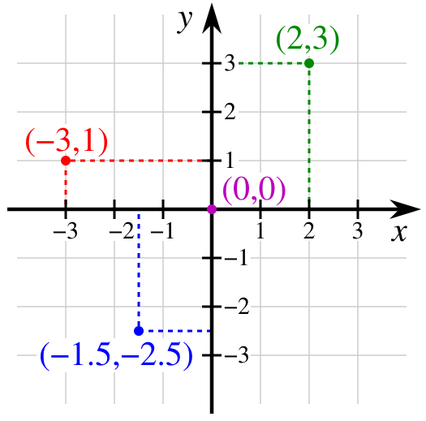
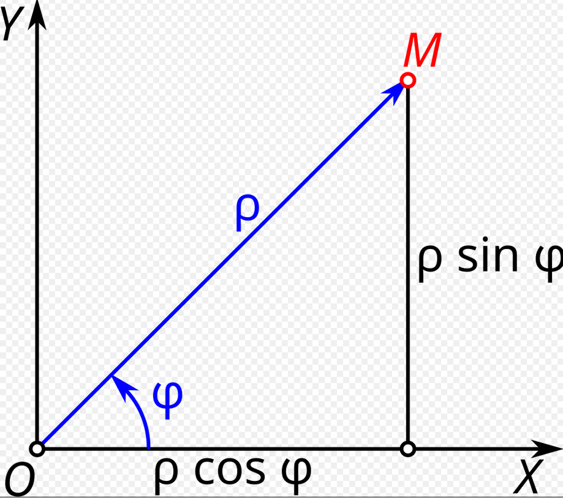

# Расчет растояния

**Прямоугольная (декартова) система координат** — прямолинейная система координат с взаимно перпендикулярными координатными осями на плоскости или в пространстве

  

**Полярная система координат** — система координат на плоскости, определяющаяся двумя полярными координатами $ρ$ и $φ$ , которые связаны с декартовыми прямоугольными координатами $x$ и $y$ следующими выражениями:
$x’ = ρ * cos(φ), y’ = ρ * sin(φ)$

  

**Отличие декартового пространства от полярного** в том, что в декартовом пространстве каждая точка задаётся двумя числами: координатой по горизонтальной оси (x) и координатой по вертикальной оси (y). Точка пересечения этих осей является началом координат. 

В полярном пространстве каждая точка задаётся двумя числами: радиусом (r) и углом (обозначим его греческой буквой фи). Радиус всегда больше или равен нулю (это расстояние от начала системы координат (полюса) до точки). Под углом имеется в виду угол между горизонтальной линией, проведённой через полюс, и линией, проведённой через полюс и точку

**Вычисляем декартову координату x₂** по формуле x’ = ρ * cos(φ). (косинус угла в радианах)
**Вычисляем декартову координату y₂** по формуле y’ = ρ * sin(φ). (синус угла в радианах)

**Расстояние между двумя точками** евклидова пространства, вычисляемое по теореме Пифагора:
$$
AB = \sqrt{(x_b - x_a)^2 + (y_b - y_a)^2}
$$